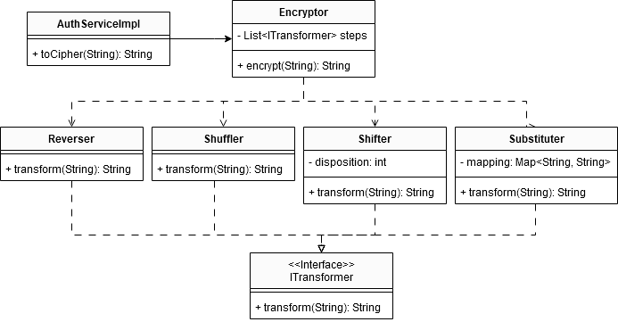
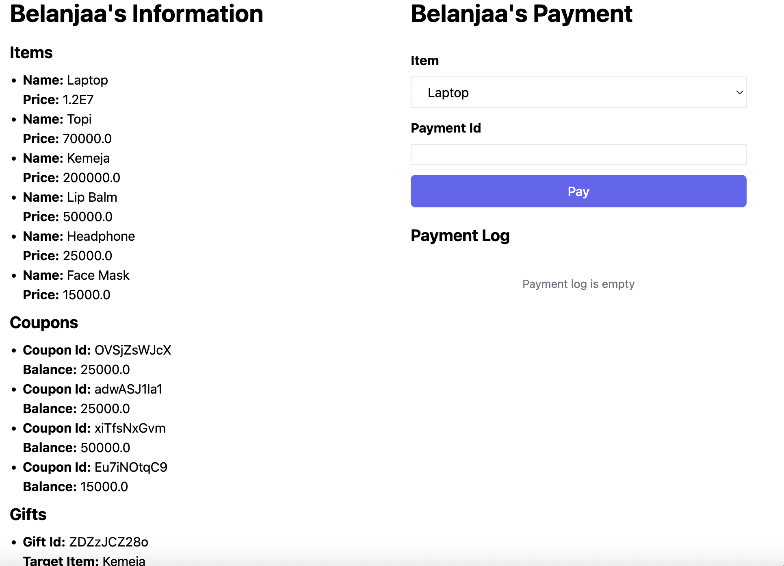
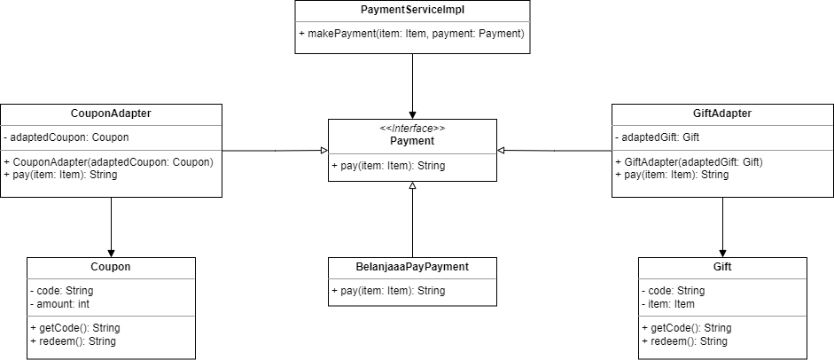

# Tutorial 3
Pada sesi tutorial 3 ini, kamu akan menerapkan *design pattern* yang sudah kamu pelajari minggu ini, yaitu `Facade Pattern` dan `Adapter Pattern`.

## Facade Pattern - Sistem Autentikasi

Kamu diminta oleh PT Kessoku untuk membuat sebuah sistem autentikasi yang memiliki beberapa langkah dalam mekanisme pengamanan data penting seperti `password` pengguna.

- Melakukan `shuffle` dengan dengan seed 11 (randomize urutan karakter dengan seed tertentu)
- Melakukan `substitusi` karakter sebanyak 2 karakter (misal dari a menjadi c, b menjadi d, dan seterusnya)
- Melakukan `shift` karakter sebanyak 3 karakter ke `kanan` (misalnya dari 'sunnypeace' menjadi 'acesunnype')
- Melakukan `reverse` karakter untuk memutarbalikkan urutan karakter (misalnya 'acesunnype' menjadi 'epynnuseca')
- Melakukan `substitusi` karakter lagi sebanyak 15 karakter
- Melakukan `shift` karakter sebanyak 5  karakter ke `kiri`
- Melakukan `shuffle` dengan seed 37

Setelah itu, kamu diminta untuk menyimpan pasangan `username` dan `password` yang telah ter-`enkripsi` ke dalam sebuah map.

### Requirements
- Pada endpoint `/auth/login` pengguna harus dapat memasukkan `username` dan `password`. Jika kombinasi `username` dan `password` sesuai, maka akan muncul notifikasi sukses, dan gagal jika sebaliknya.
- Pada endpoint`/auth/register`pengguna harus dapat mendaftarkan `username` dan `password` yang nantinya akan digunakan untuk login
- `Password` yang tersimpan harus dalam kondisi terenkripsi sesuai dengan mekanisme di atas
- Implementasi dengan *design pattern* yang tepat

### UML Diagram

## Adapter Pattern
Oleh *startup e-commerce* Belanjaaa, kamu diminta untuk mengimplementasikan sistem kupon dan *gift* yang terintegrasi dengan sistem pembayaran yang sudah dimiliki oleh mereka. Saat ini, mereka sudah mendukung metode pembayaran dengan *e-wallet* BelanjaaaPay.

Ketentuan untuk sistem kupon adalah:

- Terdapat 3 jenis kupon yang rencananya akan ditawarkan, yaitu kupon belanja **Rp15.000,00**, **Rp25.000,00**, dan **Rp50.000,00**.
- Kupon ini hanya dapat digunakan untuk **pembelian dengan nominal yang sama dengan nilai kupon**.
- Kupon dapat digunakan dengan cara memasukkan **kode unik** pada halaman pembayaran.
- Satu kupon hanya dapat digunakan sebanyak **satu kali**.

Ketentuan untuk sistem *gift* adalah:

- Terdapat 3 jenis gift berupa ***face mask***, **kemeja**, dan ***headphone***.
- Sebuah *gift* hanya dapat ditukarkan dengan **satu barang dengan jenis yang sesuai**.
- *Gift* dapat digunakan dengan cara memasukkan **kode unik** pada halaman pembayaran.
- Satu *gift* hanya dapat digunakan sebanyak **satu kali**.
 
### Requirements

- Pada *endpoint* `/belanjaa`, pengguna dapat melakukan pembayaran untuk suatu barang dengan metode pembayaran yang diinginkan. Program harus dapat menampilkan log yang sesuai dengan metode pembayaran yang dipilih. Tampilan halaman pembayaran adalah sebagai berikut.

- Implementasi dengan *design pattern* yang tepat.

### UML Diagram

