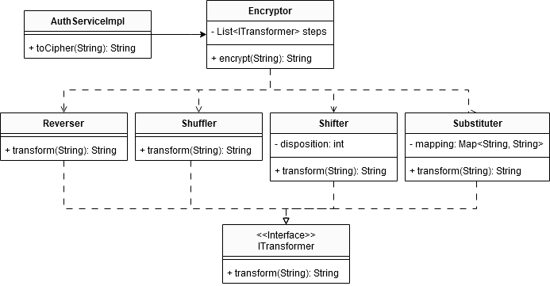

# Tutorial 3
Pada sesi tutorial 3 ini, kamu akan menerapkan *design pattern* yang sudah kamu pelajari minggu ini, yaitu `Facade Pattern` dan `Adapter Pattern`.

## Facade Pattern

Kesuksesanmu dalam menyelesaikan masalah yang ada dengan *design pattern* yang tepat pada perusahaan-perusahaan sebelumnya membuatmu semakin terkenal. Mulai banyak permintaan pekerjaan yang berdatangan dan kamu ingin mencari pekerjaan yang lebih menantang lagi. Tiba-tiba kamu dihubungi oleh teman baikmu pada masa SMA dulu. Temanmu ini sekarang adalah direktur dari PT Kessoku yang menyediakan layanan *streaming* musik.

Baru-baru ini, sistem keamanannya diretas dan ia meminta bantuanmu untuk memperbaiki sistem autentikasi pada layanan tersebut. Kali ini, kamu diminta untuk membuat sebuah sistem autentikasi yang memiliki beberapa langkah dalam melakukan pengamanan data penting seperti `password` pengguna.

Temanmu meminta agar `password` yang disimpan pada sistem telah melalui tahap `enkripsi` terlebih dahulu dengan ketentuan:

- Melakukan `shuffle` dengan dengan seed 11 (randomize urutan karakter dengan seed tertentu)
- Melakukan `substitusi` karakter sebanyak 2 karakter (misal dari a menjadi c, b menjadi d, dan seterusnya)
- Melakukan `shift` karakter sebanyak 3 karakter ke `kanan` (misalnya dari 'sunnypeace' menjadi 'acesunnype')
- Melakukan `reverse` karakter untuk memutarbalikkan urutan karakter (misalnya 'acesunnype' menjadi 'epynnuseca')
- Melakukan `substitusi` karakter lagi sebanyak 15 karakter
- Melakukan `shift` karakter sebanyak 5  karakter ke `kiri`
- Melakukan `shuffle` dengan seed 37

Setelah itu, kamu diminta untuk menyimpan pasangan `username` dan `password` yang telah ter-`enkripsi` ke dalam sebuah map.

Ada dua layanan autentikasi yang disediakan oleh PT Kessoku, yaitu login dan register. Pada endpoint `/auth/login`, kecocokan kombinasi `username` dan `password` akan memunculkan notifikasi sukses, sementara bila tidak cocok akan memunculkan notifikasi gagal. Selain itu, pada endpoint`/auth/register`pengguna harus bisa mendaftarkan `username` dan `password` yang nantinya akan digunakan untuk login.

`Password` yang tersimpan harus dalam kondisi terenkripsi sesuai dengan mekanisme di atas. Tentunya, implementasi yang dilakukan harus dengan *design pattern* yang tepat mengingat reputasimu yang sudah bagus sekarang ini.

### UML Diagram

## Adapter Pattern

Kesuksesanmu dalam menangani masalah keamanan pada layanan *streaming* musik PT Kessoku menarik perhatian sebuah *startup e-commerce* baru, yaitu Belanjaaa. Saat ini, aplikasi Belanjaaa dapat menerima pembayaran menggunakan sistem *e-wallet* mereka yang bernama BelanjaaaPay. 

Untuk menarik lebih banyak pengguna, Belanjaaa berencana untuk menawarkan kupon dan *gift* pada pengguna baru. Terdapat 3 jenis kupon yang rencananya akan ditawarkan, yaitu kupon belanja **Rp15.000,00**, **Rp25.000,00**, dan **Rp50.000,00**. Kupon ini hanya dapat digunakan untuk **pembelian dengan nominal yang sama dengan nilai kupon**, dan hanya dapat digunakan sebanyak **satu kali**. 

Sementara itu, Belanjaaa juga bekerja sama dengan perusahaan *skincare* PT Glowing, perusahaan *fashion* PT Sumber Outfit, dan *brand* elektronik Lagitech untuk mengadakan 3 jenis *gift* berupa ***face mask***, **kemeja**, dan ***headphone***. Sebuah *gift* hanya dapat ditukarkan dengan **satu barang dengan jenis yang sesuai**. Pengguna dapat membayar suatu barang menggunakan kupon atau *gift* dengan cara memasukkan **kode unik** kupon atau *gift* yang mereka miliki di halaman pembayaran. Seperti kupon, *gift* juga hanya dapat digunakan **satu kali**. 

Permasalahan terjadi karena tim *developer* Belanjaaa mengalami kesulitan ketika harus mengintegrasikan mekanisme kupon dan *gift* ini pada sistem pembayaran yang sudah ada. Dalam mengimplementasikan solusi permasalahan ini, kamu diharapkan untuk menggunakan *design pattern* yang tepat. Hasil pekerjaanmu akan dapat diakses dari *endpoint* `/belanjaa` dengan tampilan sebagai berikut.

### UML Diagram

